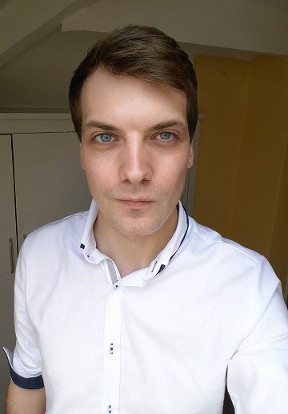

# Japanese Linguist | Software Engineer 
 

| Sheffield University | Queen Mary University of London 
|:--------             |:-------:
| Undergraduate        | Masters   
| Japanese Studies     | Computer Science   
| 2:1 Honors (68%)     | Distinction (80%)     

My interests:
  * Machine Translation
  * Japanese --> English Localization 
  * Theoretical Computer Science
  * Computer Graphics    

ddddddddddlkasdlkasdlkasldkasldalskkkkkkkkkkkkkkkkkkkkkkkkkkkkkkkkkkkkkkkkkkkkkkkkkkkkkkkkkkkkkkkkkkkkkkkkkkkkkkkkkkkkkkkkkkkkkkkkklaksdlasdlaksdlaklsdkasd

ddddddddddlkasdlkasdlkasldkasldalskkkkkkkkkkkkkkkkkkkkkkkkkkkkkkkkkkkkkkkkkkkkkkkkkkkkkkkkkkkkkkkkkkkkkkkkkkkkkkkkkkkkkk
